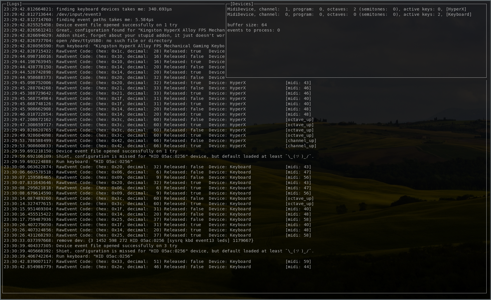

# keyboard3000
faster and even more ultimate [keyboard2000](https://github.com/gethiox/keyboard2000) implementation!

## What it is?

Keyboard3000 is an ultimate midi event generator out of computer
keyboard presses, prepared for [Jack audio system](http://jackaudio.org/)

Project status is experimental but useful for now I think.
The only dependency is [Xthexder](https://github.com/xthexder)'s [go-jack](https://github.com/xthexder/go-jack) bindings

## Notes

Please keep in mind this software needs to have direct access to input devices
which is a **security risk**, always make sure that running code is trusted.

Do not run it under root, simply add `input` group to some temporary user instead.
Adding `input` group pernamently to your daily user is strongly **not recommended**.

## Features

- [x] cool name
- [x] somehow working
- [x] mapping device keys by dedicated file configurations
  - [x] different keys can be mapped to same note/function
  - [x] port autoconnection section
  - [x] three midi events generation behaviours (see [default.yml](maps/default.yml))
- [x] dynamically attach and deattach new and removed devices
- [x] non-overlapping midi events, even when octave or channel change
      happen during some already played midi notes (this is the main reason behind this project)
- [x] odd, old, realtime terminal UI
- [x] works under naked TTY (as long as JACK® is running)
- [ ] perfectly implemented